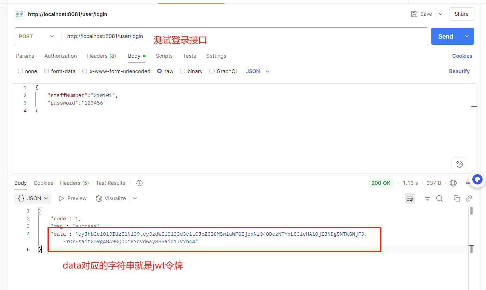
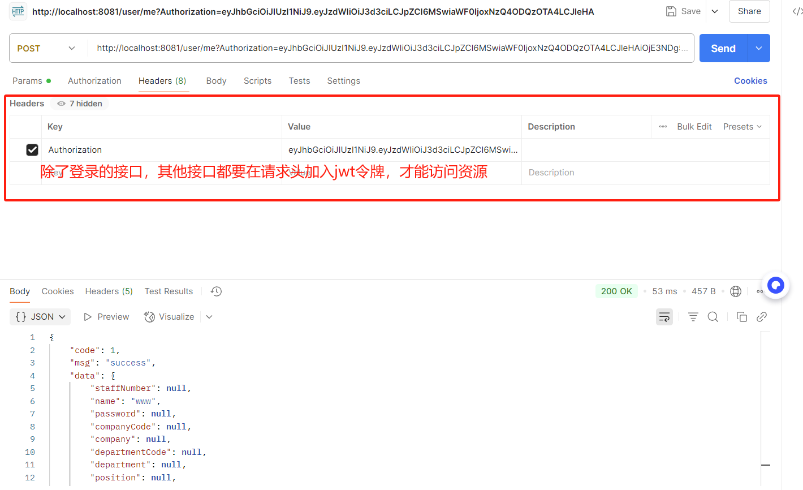

# 后端本地部署文档
## 1.后端从workOrder拉取最新代码，前端从dev拉取联调代码。
## 2.确认运行环境已经下载：编译器Idea+jdk17+MySQL
## 3.构建maven依赖:运行mvn clean , mvn install
## 4.idea连接本地MySQL数据库，执行workorder.sql文件。
## 5.运行SpringVueDemoApplication.java文件，用postman发请求，端口号8080.
- 请求参数参照接口文档，注意有的参数必填。
- 请求url样例：http://localhost:8080/workOrder/page。

## 功能测试

1. ***登录功能***：用户可以通过工号或者手机号进行登录，判断密码是否正确，若校验成功则生成jwt令牌返回前端，jwt令牌保存用户的个人信息，此后用户每次请求都要在请求头中增加jwt令牌拦截器会通过令牌判断用户状态，可以维持一段时间的登录状态，超过一天则自动退出登录  
   执行最新的workOrder.sql,需要先在staff表中插入一个用户数据，注意有些字段不能为空
postman测试：

